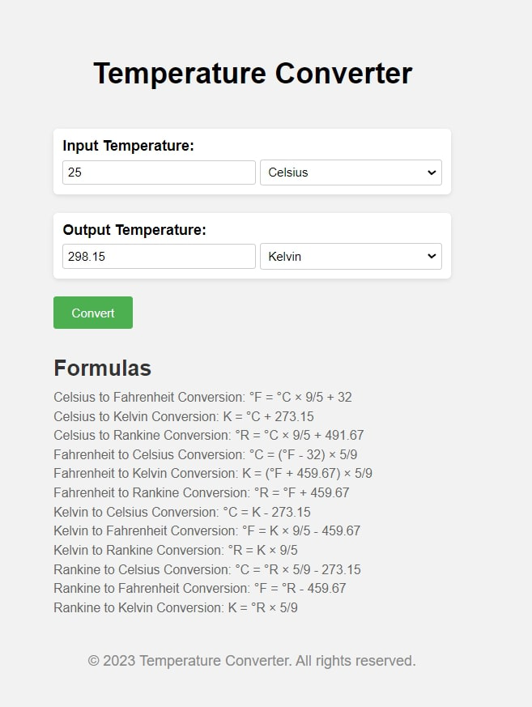

# Temperature Converter

Temperature Converter is a user-friendly web application that allows users to convert temperatures between Celsius, Fahrenheit, Kelvin, Rankine, Reaumur, and the Triple Point of Water. With its intuitive interface, users can easily input a temperature value and select the desired units for conversion.

## Features

- Conversion between Celsius, Fahrenheit, Kelvin, Rankine, Reaumur, and Triple Point of Water.
- Real-time updates: As the user enters a temperature, the converted values are instantly displayed in other units.
- Clear conversion formulas are provided on the page for transparency.
- Responsive design: The application adapts to different screen sizes and devices.

## Screenshots

## Getting Started

To run the Temperature Converter locally, follow these steps:

1. Clone the repository: `git clone https://github.com/yourusername/temperature-converter.git`
2. Open `index.html` in your web browser.

## Contributing

We welcome contributions to enhance the functionality and usability of the Temperature Converter. If you find any issues or have ideas for improvements, feel free to submit a pull request or open an issue.

## License

This project is licensed under the MIT License - see the [LICENSE](LICENSE) file for details.

## Acknowledgments

- [Font Awesome](https://fontawesome.com/) for the icons used in the project.
